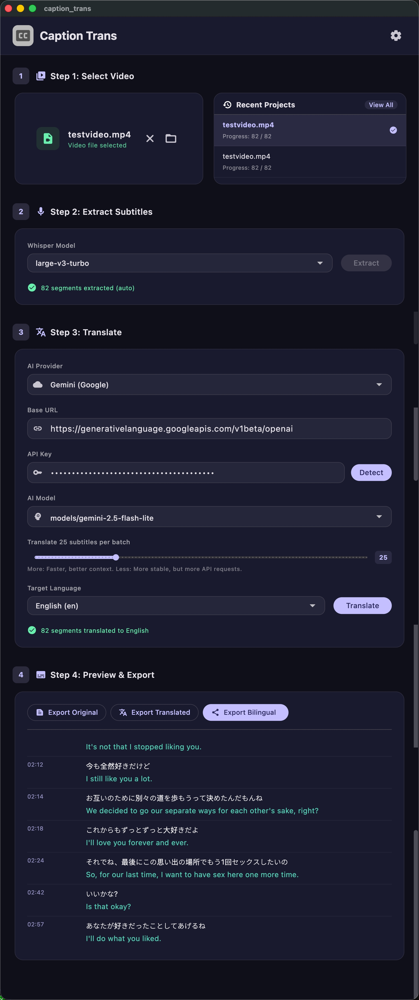

<h3 align="center">Caption Translator</h3>

  

  
  

# What is Caption Trans?
Import videos, extract subtitles, and use AI to translate them into the target language.
Supports: Google Gemini (tested), OpenAI, DeepSeek, Ollama, and other OpenAI-compatible API services.

# Download
Supports macOS (Apple Silicon) and Windows.

Please go to [Releases](https://github.com/cddqssc/Caption-Trans/releases) to download.

## ⚠️ How to open on macOS
1. Double-click the app. It will be blocked by the system because it has not been signed with an Apple developer certificate.
2. Go to **System Settings** > **Privacy & Security**.
3. Scroll down to the Security section and click **"Open Anyway"** next to the app's block message.
4. Enter your Mac password and click **"Open"**. 
*(You only need to do this once.)*

# App Screenshot

# Tips
Currently, only the Gemini API has been tested. **gemini-2.5-flash-lite** is recommended.

It balances speed and quality, and the price is relatively low. It can also translate sensitive content.

For models above Gemini 3, translating sensitive content may return an empty result, and the price is higher.

# License
[MIT License](LICENSE)

